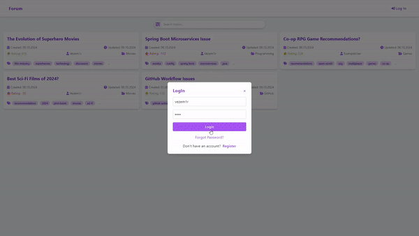

# [Forum Project]()

**Description**: The Forum Project is an online platform where users can create and discuss various topics.
It supports features such as user authentication, real-time communication using **WebSockets**, and the ability to create topics with banners and attachments.
Additionally, the application utilizes **SMTP** for sending emails, providing users with essential email verification.

- [ ] Add private chat using websocket
- [ ] Add Admin and guest roles with their functionality
- [ ] Deploy

---

## Frontend Repository
Find the frontend part of this project [here](https://github.com/Vezem1r/SpringForumFrontend).

---

## How to Build the Project

To set up and run the backend project locally, follow steps from our [wiki](https://github.com/Vezem1r/SpringForum/wiki/Build-and-Environment-Configuration-Guide).

---

## Roles and Permissions

This forum application includes various roles, each with different permissions:

- **Admin**
  - 🛠️ Full access to the forum.
  - 👥 Can manage users, topics, comments, categories, and tags.
  - 📊 Can view basic forum statistics.
- **User**
  - 📝 Can create topics and comments with multipart attachments.
  - 💬 Can reply to comments.
  - 👍👎 Can upvote and downvote topics and comments.
  - 👤 Has a personal profile displaying their personal information (email is hidden to other users), topics, and overall rating.
  - ✏️ Can change their username, avatar, and password with email verification.
  - 📩 ~~Can send messages to different users and receive messages.~~
  - 🔔 Has personal notifications for:
    - 🆕 New comments on their topics.
    - 📊 Changes in the rating of their topics or comments.
    - ✉️ Personal messages.

- **Guest**
  - 👁️ Can view users' profiles, topics, and comments.
  - 🔍 Can search for topics based on various criteria.
  - 🚫 No permissions to interact with posts or comments.

---

## Technologies Used

This project is built with the following technologies:

- **Backend**:
  - ☕ Java 21
  - 🚀 Spring Boot 3.3.4 (Data JPA, Security, Web, Mail, WebSocket)
  - 🗄️ MariaDB (as the database)
  - 🔑 JWT for authentication
  - 🛠️ Lombok (for reducing boilerplate code)
  - 📄 Swagger (for API documentation)
  - 📜 Logback (for logging)
  

- **Frontend**:
  - ⚛️ React
  - 🎨 Tailwind CSS
  - 🌐 WebSocket
  - 🍞 React Toastify
  - 📦 React Icons
